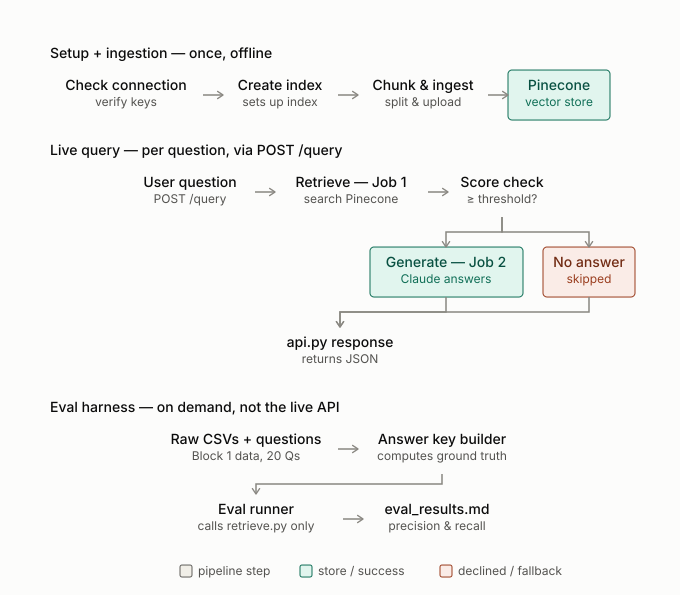

# genai-block4-rag-eval

Clinical RAG service — Pinecone retrieval, Claude-generated cited answers, and a precision/recall eval harness.

Full design reasoning lives in `docs/spec.md`; this file covers setup, architecture, and how the project was built.

## Setup

1. Python 3.11, then create and activate a virtual environment.
2. Install pinned dependencies:
   ```
   pip install -r requirements.txt
   ```
3. Copy the env template and fill in real credentials:
   ```
   cp .env.example .env
   ```
   Required: `PINECONE_API_KEY` (full access — used by `create_index.py`,
   `ingest.py`, `verify.py`), `PINECONE_QUERY_API_KEY` (scoped to
   DataPlaneViewer, query only — used by `retrieve.py`/the live API, so a
   compromise of the query path can't write or delete index data),
   `PINECONE_INDEX_NAME`, `ANTHROPIC_API_KEY`.
4. Run the whole setup-through-verify pipeline with one command:
   ```
   python scripts/run_all.py
   ```
   This runs, in order: `check_connection` (confirms both API keys work) →
   `create_index` (creates the Pinecone index if it doesn't exist yet) →
   `ingest` (chunks `data/raw/graph_export.jsonl` and uploads to Pinecone,
   deleting and reloading the namespace fresh) → `verify` (confirms
   credentials, index reachability, chunk count, idempotency, a sample
   query, and that an eval report exists). It stops immediately if any
   step fails.

   Note: this performs a full ingestion **twice** — once from the `ingest`
   step itself, and again when `verify`'s idempotency check re-runs
   ingestion to confirm re-running it produces an identical vector count.
   The longer runtime this causes is expected, not a bug.
5. Start the API:
   ```
   uvicorn scripts.api:app --reload
   ```
   Then `POST /query` with `{"question": "...", "top_k": 20}`.
6. Run the eval harness separately, on demand (not part of `run_all.py`):
   ```
   python scripts/run_eval.py [--top-k N] [--threshold T]
   ```
   Results are written to `docs/eval_results.md`.
7. Run the unit test suite:
   ```
   pytest
   ```

## Metadata filtering

`POST /query` accepts optional structured filters alongside the question,
narrowing retrieval to exact metadata matches before similarity ranking:
`condition`, `drug`, `lab` (`SBP`/`BMI`/`Glucose`/`HbA1c`), `comparison`
(`above`/`below`), `value`, `gender` (`M`/`F`), `birth_decade` (e.g.
`1970`). All default to unset — a request using none of them behaves
exactly like a plain semantic-search query. `lab`, `comparison`, and
`value` must be given together; a partial combination returns HTTP 422.

Unfiltered:
```json
{ "question": "Which patients have type 2 diabetes and take metformin?" }
```

Filtered:
```json
{
  "question": "Which hypertensive men have a high latest SBP?",
  "condition": "Essential hypertension",
  "gender": "M",
  "birth_decade": 1970,
  "lab": "SBP",
  "comparison": "above",
  "value": 140
}
```

See `docs/spec.md`'s Metadata filter design section for the full
reasoning (value mapping, confirmed Pinecone client behavior, naming
matched to Block 5's `graph_tool.py`).

To test retrieval quality with filters applied, run the eval harness's
filtered mode:
```
python scripts/run_eval.py --top-k 20 --threshold 0.2 --filtered
```
See `docs/eval_results.md`'s Runs 4–7 for the filtered-vs-unfiltered
results and how those `top_k`/`threshold` values were chosen.

## Architecture



Pinecone uses integrated inference (`llama-text-embed-v2`) — this repo
never calls a separate embedding API; Pinecone embeds text server-side on
both ingest and query.

See `docs/spec.md` for the full reasoning behind every design decision
(chunking threshold, score threshold, delete-and-reload ingestion,
micro-averaged eval metrics, etc.), and `docs/eval_results.md` for the
required parameter experiment and its results.

## Project structure

```
scripts/    Pipeline code - see docs/spec.md's Architecture section for
            how each file fits together
tests/      pytest unit tests for the pure, deterministic logic
            (chunking, score-threshold decision) - no live API calls
data/raw/   Source data copied in from Block 1 and Block 3
data/eval/  Eval question set
docs/       spec.md, plan.md, tasks.md, eval_results.md
```

## AI-assisted workflow

This project was built with [Claude Code](https://claude.com/claude-code)
(Anthropic's CLI) working alongside a human developer, following a
spec-first workflow: `docs/spec.md` (what and why) was written and
reviewed before `docs/plan.md` (what to build and in what order) or any
code. Each phase got its own branch and PR.

Notable practices used throughout:
- **Test-driven development for pure logic.** `tests/test_chunking.py` and
  `tests/test_retrieve.py` were written before their corresponding
  implementation existed, confirmed to fail with the expected error first,
  then made to pass.
- **No mocking of external services.** Every script that touches Pinecone
  or Claude was run against the real APIs during development, not just
  unit-tested against a mock - including deliberately triggering failure
  paths (an invalid API key, an empty `chunk_text` string) to confirm
  actual behavior rather than assuming it.
- **Empirically confirmed, not assumed, decisions.** For example, whether
  Pinecone's cosine metric means higher-is-better was confirmed with a
  real self-match query (Phase 3) rather than trusted from documentation
  alone; the 0.75 default score threshold was later shown, via the real
  eval run in `docs/eval_results.md`, to be too high for natural-language
  questions in practice.
- **Ground truth computed, not hand-typed.**
  `scripts/build_eval_answer_key.py` recomputes each eval question's
  correct-patient-ID set directly from the raw OMOP CSVs with pandas, and
  asserts the labeling is honest before any score is trusted.
